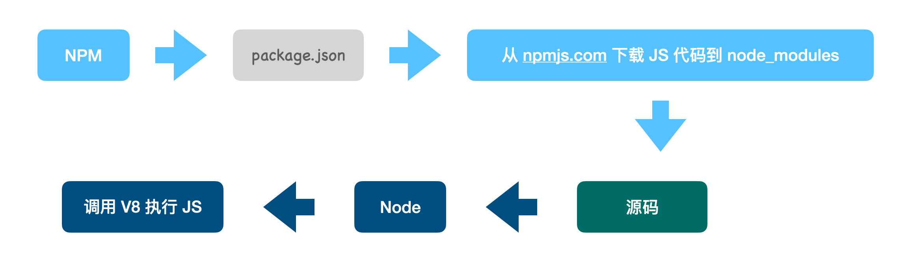
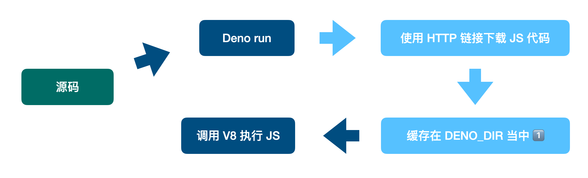

# Deno 介绍

-----
## Deno 使用方法

```bash [1-4]
brew install deno
deno init
deno run main.ts
```

```bash [2]
$ deno run https://deno.land/std@0.159.0/examples/welcome.ts
Welcome to Deno!
```

-----
## Deno 和 Node 的关键区别

1. Deno API 完全对标浏览器，内置支持 `fetch` / `storage` / `worker` / `gpu` / `importmap`，完全按照浏览器的方式引入 JS 模块（ESM+HTTP链接）；

2. Deno 对脚本带有严格的权限限制，保证其安全性；

3. Deno 拥有非常简单、自由的项目组织方式，不需要 package.json，不需要考虑打包后的巨大体积。

---
## React Demo 对比

```jsx [2-27|2]
/** node */
import React from 'react';
import logo from './logo.svg';
import './App.css';

function App() {
  return (
    <div className="App">
      <header className="App-header">
        
        <p>
          Edit <code>src/App.tsx</code> and save to reload.
        </p>
        <a
          className="App-link"
          href="https://reactjs.org"
          target="_blank"
          rel="noopener noreferrer"
        >
          Learn React
        </a>
      </header>
    </div>
  );
}

export default App;
```

```jsx [2-27|2]
/** deno */
import React from 'https://jspm.dev/react@17.0.0';

function App() {
  return (
    <>
      <link rel={'stylesheet'} href={'./static/css/App.css'}/>
      <div className="App">
        <header className="App-header">
          
          <p>
            Edit <code>App.tsx</code> and save to reload.
          </p>
          <a
            className="App-link"
            href="https://reactjs.org"
            target="_blank"
            rel="noopener noreferrer"
          >
            Learn React
          </a>
        </header>
      </div>
    </>
  );
}

export default App;
```

---
## 工作流程对比

> Node


> Deno


-----
## 疑问：用HTTP链接管理依赖靠谱吗？

-----
### Q1：依赖链接散布在好多文件里，难以管理版本

- Deno 推荐使用全局的 `deps.ts` 文件管理依赖，`import & export`

```ts
// deps.ts
export { Application, Router } from "https://deno.land/x/oak@v11.0.0/mod.ts";
export { getQuery } from 'https://deno.land/x/oak@v11.0.0/helpers.ts';
export type { Middleware } from "https://deno.land/x/oak@v11.0.0/mod.ts";
export { assert } from "https://deno.land/std@0.152.0/testing/asserts.ts";
export { config as dotEnvConfig } from "https://deno.land/x/dotenv@v3.2.0/mod.ts";
```

-----
### Q2：链接指向的代码发生了变化，我能不能感知到？

- `deno cache` 提供了 `——lock=lock.json` 参数，可以将依赖代码的 Hash 缓存下来，执行时会自动进行完整性校验。
- 注意，不在 `lock.json` 内的依赖不会被校验。

```json
{
  "https://deno.land/std@0.152.0/_util/assert.ts": "e94f2eb37cebd7f199952e242c77654e43333c1ac4c5c700e929ea3aa5489f74",
  "https://deno.land/std@0.152.0/_util/os.ts": "3b4c6e27febd119d36a416d7a97bd3b0251b77c88942c8f16ee5953ea13e2e49",
  "https://deno.land/std@0.152.0/async/deferred.ts": "bc18e28108252c9f67dfca2bbc4587c3cbf3aeb6e155f8c864ca8ecff992b98a",
  "https://deno.land/std@0.152.0/bytes/bytes_list.ts": "aba5e2369e77d426b10af1de0dcc4531acecec27f9b9056f4f7bfbf8ac147ab4",
  "https://deno.land/std@0.152.0/bytes/equals.ts": "3c3558c3ae85526f84510aa2b48ab2ad7bdd899e2e0f5b7a8ffc85acb3a6043a",
  "https://deno.land/std@0.152.0/bytes/mod.ts": "763f97d33051cc3f28af1a688dfe2830841192a9fea0cbaa55f927b49d49d0bf",
  "https://deno.land/std@0.152.0/crypto/timing_safe_equal.ts": "82a29b737bc8932d75d7a20c404136089d5d23629e94ba14efa98a8cc066c73e",
  "https://deno.land/std@0.152.0/encoding/base64.ts": "c57868ca7fa2fbe919f57f88a623ad34e3d970d675bdc1ff3a9d02bba7409db2",
  "https://deno.land/std@0.152.0/fmt/colors.ts": "6f9340b7fb8cc25a993a99e5efc56fe81bb5af284ff412129dd06df06f53c0b4",
  "https://deno.land/std@0.152.0/http/_negotiation/common.ts": "410e902f01cdd324e4746e8017595be4fc357d6fc4cd6044f2f808a943d7eaf7",
  "https://deno.land/std@0.152.0/http/_negotiation/encoding.ts": "f749c1d539d139af783e8a7741de5a47a98a5e3c9af82b8af512567ccf5fe632",
  "https://deno.land/std@0.152.0/http/_negotiation/language.ts": "53c306186904d2dace4c624a8822542866ad332a7f40ac90e0af1504f95c63d0",
  "https://deno.land/std@0.152.0/http/_negotiation/media_type.ts": "ecdda87286495f7ff25116858f5088856953e2f1585e593d314e0c71b826a137",
  "https://deno.land/std@0.152.0/http/http_errors.ts": "fe9b7f95f7ee0592c3306f8c7aed03ba53d55d1ef81e00041c1171b9588f46d9",
  "https://deno.land/std@0.152.0/http/http_status.ts": "897575a7d6bc2b9123f6a38ecbc0f03d95a532c5d92029315dc9f508e12526b8",
  "https://deno.land/std@0.152.0/http/negotiation.ts": "f35b1ff2ad4ff9feaa00ac234960b398172768205c8eceaef7f2eafe34716ba2",
  "https://deno.land/std@0.152.0/io/buffer.ts": "bd0c4bf53db4b4be916ca5963e454bddfd3fcd45039041ea161dbf826817822b",
  "https://deno.land/std@0.152.0/io/readers.ts": "45847ad404afd2f605eae1cff193f223462bc55eeb9ae313c2f3db28aada0fd6",
  "https://deno.land/std@0.152.0/io/types.d.ts": "0cae3a62da7a37043661746c65c021058bae020b54e50c0e774916e5d4baee43",
  "https://deno.land/std@0.152.0/media_types/_util.ts": "ce9b4fc4ba1c447dafab619055e20fd88236ca6bdd7834a21f98bd193c3fbfa1",
  "https://deno.land/std@0.152.0/media_types/mod.ts": "3829264ca0610cac40f3214f939d7733483523f82bc1041c51045d7c75fb93b8",
  "https://deno.land/std@0.152.0/media_types/vendor/mime-db.v1.52.0.ts": "724cee25fa40f1a52d3937d6b4fbbfdd7791ff55e1b7ac08d9319d5632c7f5af",
  "https://deno.land/std@0.152.0/path/_constants.ts": "df1db3ffa6dd6d1252cc9617e5d72165cd2483df90e93833e13580687b6083c3",
  "https://deno.land/std@0.152.0/path/_interface.ts": "ee3b431a336b80cf445441109d089b70d87d5e248f4f90ff906820889ecf8d09",
  "https://deno.land/std@0.152.0/path/_util.ts": "c1e9686d0164e29f7d880b2158971d805b6e0efc3110d0b3e24e4b8af2190d2b",
  "https://deno.land/std@0.152.0/path/common.ts": "bee563630abd2d97f99d83c96c2fa0cca7cee103e8cb4e7699ec4d5db7bd2633",
  "https://deno.land/std@0.152.0/path/glob.ts": "cb5255638de1048973c3e69e420c77dc04f75755524cb3b2e160fe9277d939ee",
  "https://deno.land/std@0.152.0/path/mod.ts": "56fec03ad0ebd61b6ab39ddb9b0ddb4c4a5c9f2f4f632e09dd37ec9ebfd722ac",
  "https://deno.land/std@0.152.0/path/posix.ts": "c1f7afe274290ea0b51da07ee205653b2964bd74909a82deb07b69a6cc383aaa",
  "https://deno.land/std@0.152.0/path/separator.ts": "fe1816cb765a8068afb3e8f13ad272351c85cbc739af56dacfc7d93d710fe0f9",
  "https://deno.land/std@0.152.0/path/win32.ts": "bd7549042e37879c68ff2f8576a25950abbfca1d696d41d82c7bca0b7e6f452c",
  "https://deno.land/std@0.152.0/streams/conversion.ts": "fc3db02026183da795fa32ac7549868e9f19c75ba029d4b4c3739af62b48517a",
  "https://deno.land/std@0.152.0/testing/_diff.ts": "029a00560b0d534bc0046f1bce4bd36b3b41ada3f2a3178c85686eb2ff5f1413",
  "https://deno.land/std@0.152.0/testing/_format.ts": "0d8dc79eab15b67cdc532826213bbe05bccfd276ca473a50a3fc7bbfb7260642",
  "https://deno.land/std@0.152.0/testing/asserts.ts": "093735c88f52bbead7f60a1f7a97a2ce4df3c2d5fab00a46956f20b4a5793ccd",
  "https://deno.land/x/dotenv@v3.2.0/mod.ts": "077b48773de9205266a0b44c3c3a3c3083449ed64bb0b6cc461b95720678d38e",
  "https://deno.land/x/dotenv@v3.2.0/util.ts": "693730877b13f8ead2b79b2aa31e2a0652862f7dc0c5f6d2f313f4d39c7b7670",
  "https://deno.land/x/oak@v11.0.0/application.ts": "3a7f7a58387e31471a77801138f9b67eb75a96acbda4d5c42cb58f36e814dd7c",
  "https://deno.land/x/oak@v11.0.0/body.ts": "4e88a99a2a1023177c6dce30d4aad279166dffe3af8dbfc805492e83705ea8d4",
  "https://deno.land/x/oak@v11.0.0/buf_reader.ts": "7cf96aa0ac670b75098113cf88a291a68332cc45efa8a9698f064ac5b8098a0f",
  "https://deno.land/x/oak@v11.0.0/content_disposition.ts": "8b8c3cb2fba7138cd5b7f82fc3b5ea39b33db924a824b28261659db7e164621e",
  "https://deno.land/x/oak@v11.0.0/context.ts": "ee76dc8ea7e8e455c89ed75d36df8f2c2b7c1554b695b93b610d00fbe7cc3ab5",
  "https://deno.land/x/oak@v11.0.0/cookies.ts": "d9f94b99f26c6169c6982ce12323c41a548d001bfc28f464264c22dc3dbf2181",
  "https://deno.land/x/oak@v11.0.0/deps.ts": "b897b0f2bec99cd8b402b279b7f21de955d98cbd72835b6c912be5e11c26148b",
  "https://deno.land/x/oak@v11.0.0/etag.ts": "19918f5e1964e3fe6c9fe524a88ffbf9900ce1dfe4146b187b2a86256bb6b663",
  "https://deno.land/x/oak@v11.0.0/headers.ts": "f50fb05614432bda971021633129aa2e8737e0844e0f01c27a937997b4d8dd4f",
  "https://deno.land/x/oak@v11.0.0/helpers.ts": "42212afa07a560b2958359cc19577417e89d9574d6579551a0af36ff7f00cc6e",
  "https://deno.land/x/oak@v11.0.0/http_request.ts": "0831c828816fcb58a5aa8361c6865c4151f4c8b59fabcef2e2cd235bb28170c5",
  "https://deno.land/x/oak@v11.0.0/http_server_flash.ts": "e2f422d5bc59647490a8cffe32a6cc64b147bbedb6410a88488983ea988e3921",
  "https://deno.land/x/oak@v11.0.0/http_server_native.ts": "549dffcd2db5cbb0e44ad50cf9c54956b42a10450b1ac66e1362e32a073c8c1b",
  "https://deno.land/x/oak@v11.0.0/http_server_native_request.ts": "07910ea2ed51af6c4e69addf9015cdd8d2b5c9ee03fd4993e386834a129a9eb6",
  "https://deno.land/x/oak@v11.0.0/isMediaType.ts": "62d638abcf837ece3a8f07a4b7ca59794135cb0d4b73194c7d5837efd4161005",
  "https://deno.land/x/oak@v11.0.0/keyStack.ts": "fa0d5898fb8ba34de1c9cdcf4b2e8434952dc9931671858d33560368784a22ef",
  "https://deno.land/x/oak@v11.0.0/mediaTyper.ts": "042b853fc8e9c3f6c628dd389e03ef481552bf07242efc3f8a1af042102a6105",
  "https://deno.land/x/oak@v11.0.0/middleware.ts": "de14f045a2ddfe845d89b5d3140ff52cbcc6f3b3965391106ce04480f9786737",
  "https://deno.land/x/oak@v11.0.0/middleware/proxy.ts": "b927232f97ec18af4185d7912e45b1191e3ffe24a9c875262ad524211b1274c9",
  "https://deno.land/x/oak@v11.0.0/mod.ts": "de52855c8f626e30ba683fb265c0a0773ba2f5f117b3549b7d9c857edba58338",
  "https://deno.land/x/oak@v11.0.0/multipart.ts": "98fe9f226de8c26a16d067027b69fb1e34ad8c4055767dd157907d06cea36f9a",
  "https://deno.land/x/oak@v11.0.0/range.ts": "68a6df7ab3b868843e33f52deb94c3d4cab25cb9ef369691990c2ac15b04fafb",
  "https://deno.land/x/oak@v11.0.0/request.ts": "19de7d1cf90edd85e64c1bfd91f9c018e2597d552716f68bffbd37ad4393ac69",
  "https://deno.land/x/oak@v11.0.0/response.ts": "92d75899ea00f7ac401b36d584723472973eeaff50347b619af5b810b22fcf95",
  "https://deno.land/x/oak@v11.0.0/router.ts": "518a8ef00d9969b6488bc424ca352fb8d4c8196753467aa8d23ab8ca7885365c",
  "https://deno.land/x/oak@v11.0.0/send.ts": "7ef2591792426d62add91536bb434566d4b224247ca343fdd63e486f9d4e9446",
  "https://deno.land/x/oak@v11.0.0/server_sent_event.ts": "948b0fe4cb3fe38c7db15e476eb3b7671ef20e566d130e9f701d7c0146aa47dd",
  "https://deno.land/x/oak@v11.0.0/structured_clone.ts": "ecf42598652b8082f37252cb873d6e257ad728e6fe73c6bd61f343d94501fbde",
  "https://deno.land/x/oak@v11.0.0/testing.ts": "7612656efd2975f7a2e6848609f5971922dbec46b76372c5c623202fdd7b9a85",
  "https://deno.land/x/oak@v11.0.0/types.d.ts": "41951a18c3bfdb11e40707cab75da078ba8a4907cd7d4e11d8536bc2db0dde05",
  "https://deno.land/x/oak@v11.0.0/util.ts": "3af8c4ed04c6cc2bedbe66e562a77fc59c72df31c55a902a63885861ca1639d6",
  "https://deno.land/x/path_to_regexp@v6.2.1/index.ts": "894060567837bae8fc9c5cbd4d0a05e9024672083d5883b525c031eea940e556"
}
```

-----
### 拓展：importmap 和 module

- `type="module"` 是浏览器中引入 ESM 模块的方式，可以直接通过 HTTP 路径引入 ESM 模块

```html
<script type="module">
  import capitalize from 'https://esm.sh/lodash@4.17.21/capitalize'
  console.log(capitalize('DENO'))
</script>
```

- `type="importmap"` 则相当于一个 alias 声明，可以简化 import 时的路径
```html
<script type="importmap">
  {
    "imports": {
      "lodash-es": "https://esm.sh/lodash-es@4.17.21"
    }
  }
</script>
<script type="module">
  import { camelCase } from 'lodash-es'
  console.log(camelCase('DENO LAND'))
</script>
```

---
### Q3：链接好长，写起来好麻烦
### Q4：能不能把依赖本地化？全都用网络地址很没有安全感

- A：这两个问题是递进的，官方给出的解决方案是：import-map 和 deno vendor
- deno vendor 是借助 import-map，将 import 路径从 HTTP 指向本地目录，实现依赖的本地化

```json
{
  "imports": {
    "https://deno.land/": "./deno.land/"
  }
}
```

- `deno vendor` + `lock.json`，本质上和 `node_modules` + `package-lock.json` 差别不大。通过 `import_map` 的映射，也几乎可以做到与 Node 一样的模块引入方法。

---
- 所以社区给出了这样的方案：Trex

```bash
$ trex i --map oak
{
  "imports": {
    "oak": "https://deno.land/x/oak@v11.1.0/mod.ts"
  }
}
```

```ts
// app.ts
import { Application } from "oak";

const app = new Application();

app.use((ctx) => {
  ctx.response.body = "Hello World!";
});

await app.listen({ port: 8000 });
```
-----
### Deno 依赖管理总结

- 总的来说，Deno 的依赖管理方法，即使引入了 lock/vendor/importmap 这些工具，也依然比 node_modules/package.json 要简单很多。

- 并且，不需要与 node_modules 复杂的的解析逻辑斗智斗勇，所以可以一定程度上提升开发体验。

-----
## 疑问：Deno 的安全沙箱具体是什么机制？

- 默认状态下，Deno 所执行的脚本没有访问本地运行环境的权限，deno api 访问 Native 资源时，在 Rust 层做了权限隔离。
- 可以分配的权限包括：

| 权限指令                          | 说明                          |
|-------------------------------|-----------------------------|
| `allow-env=<env>`             | 环境变量                        |
| `allow-hrtime`                | 高精度时间（high-resolution time） |
| `allow-net=<ipaddr/hostname>` | 网络地址访问                      |
| `allow-ffi`                   | 外部语言访问（调用动态链接库函数）           |
| `allow-sys`                   | 操作系统 API                    |
| `allow-read=<dir/file>`       | 读本地文件                       |
| `allow-run=<executable>`      | 创建子进程                       |
| `allow-write=<dir/file>`      | 写本地文件                       |

---
### 安全沙箱的局限

由于 Deno 并没有完全虚拟化本地资源，不是真正的类似 Docker 的容器化环境，使用 deno --allow-run 创建子进程时，子进程可以轻易地突破 Deno 所设置的权限层。

-----
## 疑问：Deno 能否适配为 Node 开发的模块？

- 绝大多数情况下，可以。Deno 提供了node api的官方Polyfill：std/node，通过下面的方法引入 NPM 包时，会自动将 node 相关依赖 polyfill 为 deno 的相关实现。
  
---
#### NPM 包使用方法：
```ts
import Koa from "https://esm.sh/koa"
import Koa from "npm:koa"
```

#### CommonJS 使用方法：
```js
import { createRequire } from "https://deno.land/std@0.160.0/node/module.ts";

const require = createRequire(import.meta.url);

const _ = require("lodash");
console.log(_.capitalize('DENO'))
```

-----
## Deno 的使用场景
1. 理论上讲，可以在几乎任意场景完全使用 deno 替换 node 来运行 JS/TS。

2. 日常的场景中，我们可以在 NPM 项目中混合使用 Deno，编写开发环境的脚本、构建流等，这不仅可以减少 node_modules 中引入的开发依赖，脚本代码也能获得完整的 TypeScript 支持（*对于 Monorepo 项目来说，可以减少相当一部分配置文件的烧脑程度……*）

3. 对于一些自用的小微项目，例如 ifttt / chatbot / 文档站等，可以使用 github + deno deploy 的工具流进行构建部署；这比 vercel 更简单直接，同时充分利用 deno 的单文件工程优势。

---
### 拓展：deno deploy

